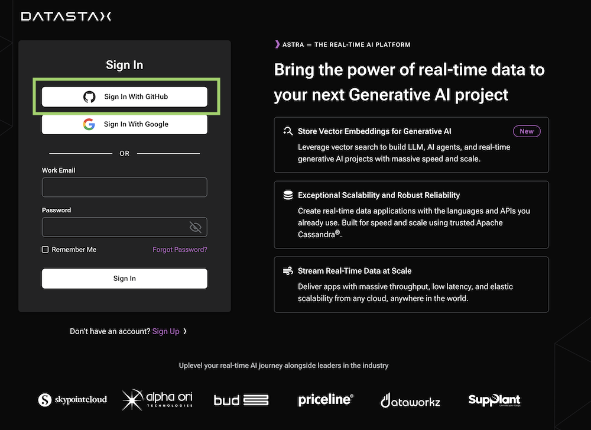
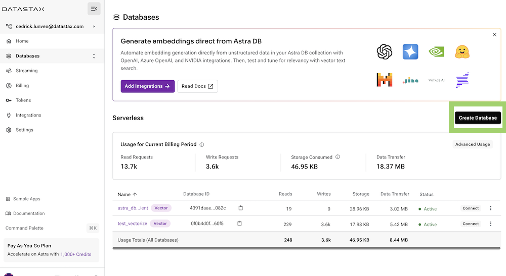
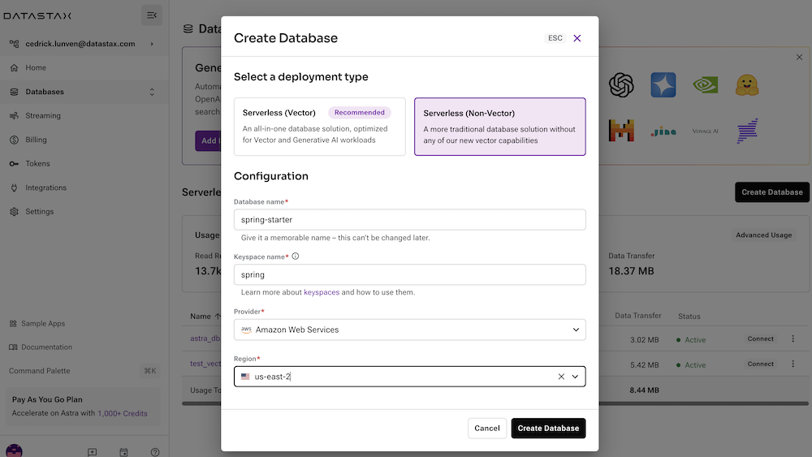
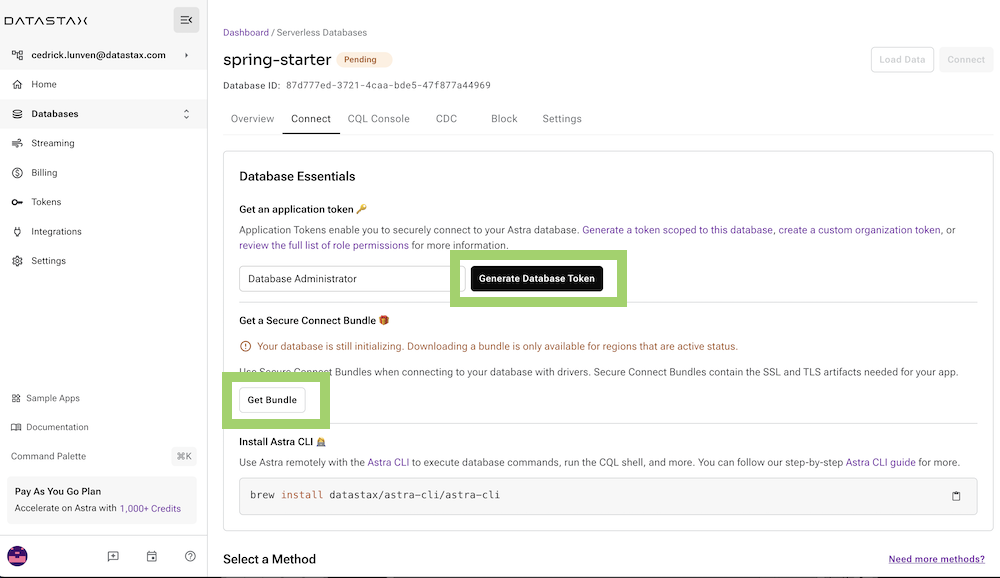
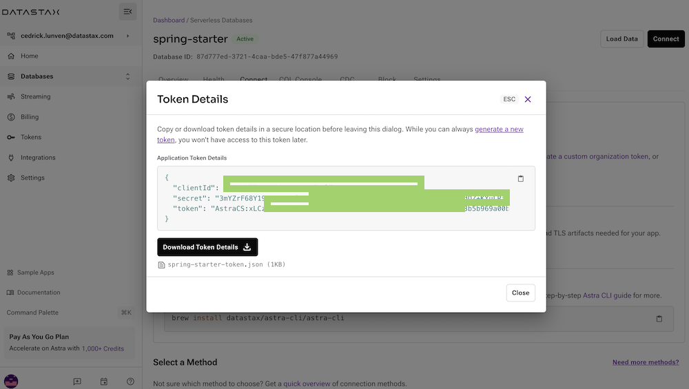
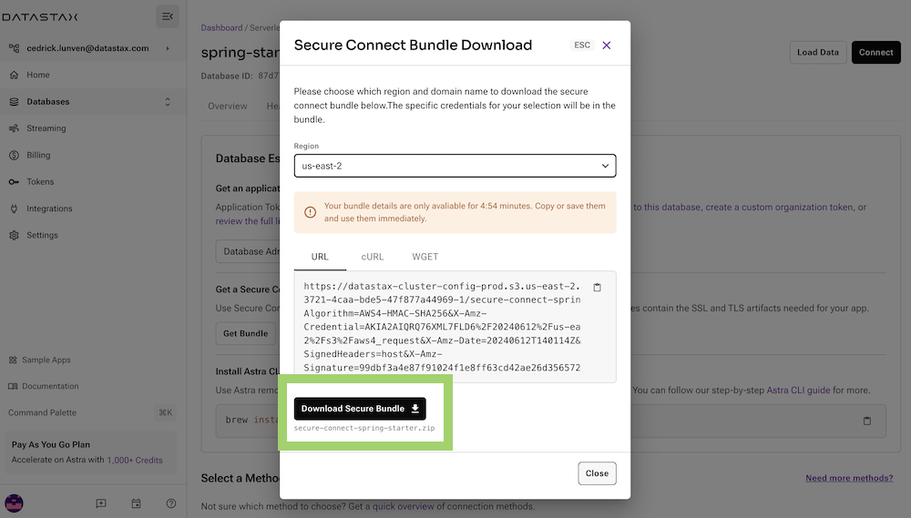

<!--- STARTEXCLUDE --->
# Spring Data Cassandra REST API
*10 minutes, Beginner, [Start Building](https://github.com/DataStax-Examples/spring-data-starter#prerequisites)*

This application uses Spring Data Cassandra and DataStax Astra DB to build a REST API for a backend service that interacts with products and orders.
<!--- ENDEXCLUDE --->

## Objectives
* Run a REST API that connects to DataStax Astra DB

## How this works
We're using Spring Data Cassandra and Datastax Astra DB to build a REST API that stores Products and Orders.

## Get Started
To build and play with this app, follow the build instructions that are located here: [https://github.com/DataStax-Examples/spring-data-starter](https://github.com/DataStax-Examples/spring-data-starter#prerequisites)

<!--- STARTEXCLUDE --->
# Running Spring Data Cassandra REST API
Follow the instructions below to get started.

## Prerequisites
Let's do some initial setup by creating a serverless(!) database.

### DataStax Astra
1. Create a [DataStax Astra account](https://dtsx.io/38HWu73) if you don't already have one:

2. On the home page. Locate the button **`Create Database`** both vector and non-vector support the Cassandra CQL

3. Populate the fields and click create database 

4. After your database is provisioned, we need to generate an Application Token for our App. Go to the `Settings` tab in the database home screen.

5. Generate a token by clicking `Generate Token` and give it a name.

6. After you have your Application Token, head to the database connect screen and select the driver connection that we need. Go ahead and download the `Secure Bundle` for the driver.

### Github
1. Click `Use this template` at the top of the [GitHub Repository](https://github.com/DataStax-Examples/spring-data-starter):

2. Enter a repository name and click 'Create repository from template':

3. Clone the repository:

## 🚀 Getting Started Paths:
*Make sure you've completed the [prerequisites](#prerequisites) before starting this step*
  - [Running on Gitpod](#running-on-gitpod)

### Running on Gitpod
1. Click the 'Open in Gitpod' link:

2. Once your Gitpod workspace has loaded, you'll be asked to paste your service account credentials in the Gitpod terminal at the bottom of the screen:

3. When the app is finished building, click the 'Open Browser' button on the bottom right of the screen:

4. You've successfully build a Spring Data Cassandra application!

<!--- ENDEXCLUDE --->
